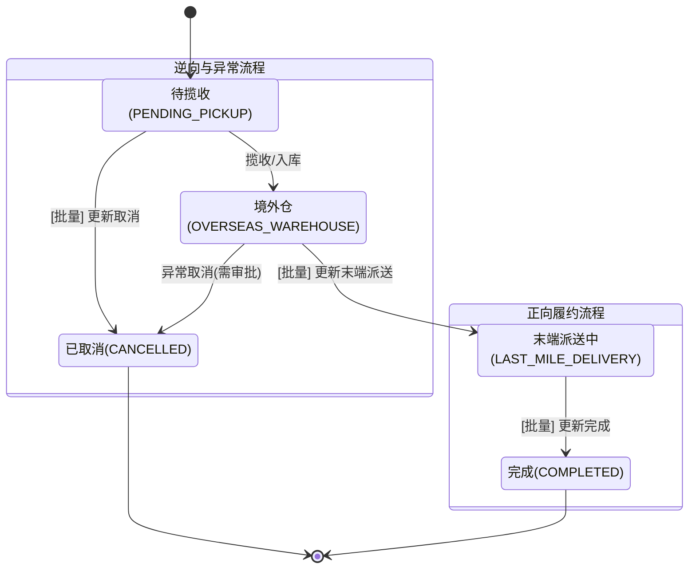

# 国际物流订单批量处理系统 PRD

| 文档属性 | 详情 |
| :--- | :--- |
| **文档版本** | v2.0 (优化版) |
| **文档状态** | 正式发布 |
| **最后更新** | 2026-01-20 |
| **对应项目** | 出海星中台系统 - 国际物流模块 |

## 1. 业务背景与价值

### 1.1 现状与痛点
*   **操作繁琐**：当前订单状态流转（尤其是“完成”状态）依赖详情页逐单操作，链路长（列表 -> 详情 -> 点击按钮 -> 确认 -> 返回列表），单均耗时约 15-20 秒。
*   **效率瓶颈**：随着订单量增长，中台运营人员在处理日均数百单的“派送完成”确认时，不仅耗费大量人力，且容易产生疲劳性误操作。
*   **WMS同步缺失**：(v1.1新增) 非光锥渠道订单需手动干预预报至华磊系统，缺乏批量入口。

### 1.2 业务目标
*   **效率提升**：将单据处理时间从分钟级降低至秒级，支持批量操作。
*   **体验优化**：统一操作入口，提供清晰的状态反馈和防呆机制。
*   **流程闭环**：完善正向（派送、完成）与逆向（取消）的全链路状态管理。

## 2. 总体方案设计

### 2.1 核心功能架构
在“国际物流订单”列表页顶部操作区，新增 **【订单状态处理】** 聚合菜单，包含以下核心功能：
1.  **批量更新末端派送**：境外仓 -> 末端派送中
2.  **批量更新完成**：末端派送中 -> 完成 (含二次确认)
3.  **批量更新取消**：待揽收 -> 已取消
4.  **推送WMS**：手动触发预报 (针对非光锥渠道)

### 2.2 状态机流转图 (State Machine)

## 3. 功能详细说明

### 3.1 交互设计通用规范
*   **入口位置**：列表页右上角操作区，【订单状态处理】下拉菜单。
*   **原子性原则**：批量操作采用 **"All or Nothing"** 机制，即选中的订单中只要有一单不符合条件，全批次操作拦截失败，并提示具体错误订单。
*   **反馈机制**：
    *   成功：Toast 绿色提示，自动刷新列表，清空勾选。
    *   失败：Dialog 弹窗警告，明确列出不合规的 **商家订单号**。

---

### 3.2 功能点拆解

#### FR-001: 批量更新末端派送
*   **定义**：将订单从“境外仓”流转至“末端派送中”。
*   **原功能变更**：原“一键更新末端派送”更名为“批量更新末端派送”，并归入下拉菜单。
*   **前置校验**：所有选中订单状态必须为 `OVERSEAS_WAREHOUSE`。
*   **异常提示**：“系统批量更新订单状态失败，存在非境外仓状态的订单信息”。

#### FR-002: 批量更新完成 (核心功能)
*   **定义**：将订单从“末端派送中”流转至“完成”。
*   **操作路径**：
    1.  用户在列表勾选订单。
    2.  点击【批量更新完成】。
    3.  **系统前置校验**：检查是否所有订单状态均为 `LAST_MILE_DELIVERY`。
        *   *校验失败*：弹出错误提示框，列出错误订单号。
        *   *校验通过*：弹出 **【确认批量更新】** 对话框。
    4.  **二次确认**：对话框展示即将更新的订单列表（订单号、当前状态），用户点击【确认更新】。
    5.  系统执行更新，返回结果。
*   **异常提示**：“系统批量更新订单状态失败，存在非末端派送中状态的订单信息，商家订单号为：XXX”。

#### FR-003: 批量更新取消
*   **定义**：将未开始履约的订单取消。
*   **原功能变更**：原“批量取消”更名为“批量更新取消”，并归入下拉菜单。
*   **前置校验**：所有选中订单状态必须为 `PENDING_PICKUP` (待揽收)。
*   **异常提示**：“系统批量更新订单状态失败，存在无法取消状态的订单（仅待揽收订单可取消）”。

#### FR-004: 推送 WMS (v1.1新增)
*   **定义**：将订单预报信息推送至华磊 WMS 系统。
*   **适用范围**：仅限 **非光锥渠道** (Channel != Lightcone) 订单。
*   **前置校验**：所有选中订单的渠道不能为“光锥”。
*   **异常提示**：“推送WMS失败：包含光锥渠道订单（无需推送），请重新选择”。
*   **成功状态**：更新 WMS 同步状态为 `SYNCED`。

---

## 4. 界面与字段定义

### 4.1 订单列表增强
新增/调整以下列以支持业务判断：
| 字段名 | 显示名称 | 说明 | 样式/逻辑 |
| :--- | :--- | :--- | :--- |
| status | 状态 | 核心状态 | Badge (灰/蓝/黄/绿/红) |
| channel | 渠道 | 区分业务来源 | "光锥" / "其他" |
| wmsSyncStatus | WMS状态 | 同步结果反馈 | "待同步" / "已同步"(绿) / "失败"(红) |

### 4.2 确认弹窗 (Dialog)
针对“批量更新完成”，弹窗需包含：
*   **标题**：确认批量更新
*   **描述**：即将把以下 N 个订单状态更新为【完成】。此操作不可逆，请确认。
*   **内容区域**：可滚动的表格，列出 `订单号` 和 `当前状态`。
*   **操作按钮**：【取消】(Secondary)、【确认更新】(Primary)。

## 5. 验收标准 (Acceptance Criteria)

### 5.1 功能性验收
1.  **入口检查**：【订单状态处理】按钮正常展开，包含4个子菜单，图标与文案正确。
2.  **正向流程验证**：
    *   [CASE 1] 勾选5单“末端派送中” -> 批量完成 -> 弹出确认框 -> 确认 -> 状态变为“完成”。
    *   [CASE 2] 勾选3单“境外仓” -> 批量末端派送 -> 直接成功 -> 状态变为“末端派送中”。
    *   [CASE 3] 勾选“待揽收” -> 批量取消 -> 成功。
3.  **异常拦截验证**：
    *   [CASE 4] 勾选“完成”状态订单 -> 点击任一更新按钮 -> 报错并展示订单号。
    *   [CASE 5] 混合勾选（1单“末端派送中” + 1单“境外仓”）-> 点击批量完成 -> **全失败**，提示错误。
    *   [CASE 6] 勾选“光锥”渠道订单 -> 点击推送WMS -> 报错拦截。

### 5.2 性能验收
*   **响应速度**：批量操作（<50单）的界面响应时间应小于 1秒。
*   **交互反馈**：点击按钮后立即给出反馈（弹窗或Toast），无视觉卡顿。

## 6. 风险评估
*   **数据一致性**：需确保后端接口具备事务性，防止部分成功部分失败导致的数据脏乱（前端已做全量校验，后端需配合）。
*   **并发操作**：多人在不同终端操作同一批订单可能导致状态冲突，建议后端增加乐观锁机制（Version Check）。
