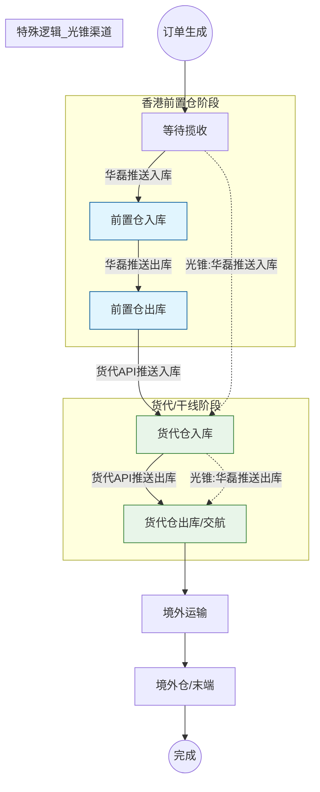

# 香港前置仓（华磊系统）数据对接与全链路轨迹可视化 PRD

| 文档属性 | 详情 |
| :--- | :--- |
| **文档版本** | v1.1 |
| **文档状态** | 优化待评审 |
| **最后更新** | 2026-02-04 |
| **对应项目** | 出海星中台系统 - 物流轨迹与仓储集成模块 |

## 1. 问题背景 (Background)

当前出海星系统在物流轨迹追踪上存在明显的**数据断点**，具体表现为：

1.  **数据脱节**：香港前置仓（作为货物跨境中转的关键节点）的操作数据未与出海星系统打通。目前系统仅依赖末端货代（如纬狮、速达非）回传的数据，导致货物在到达香港前置仓至移交货代期间处于“黑盒”状态。
2.  **状态滞后**：货物实际已抵达香港并完成操作（称重/交航），但因缺乏前置仓数据，系统仍显示为“等待揽收”，导致运营人员无法准确判断货物位置与异常。
3.  **场景差异未兼容**：
    *   **光锥渠道**：香港前置仓即为实际发货节点，应直接触发“入库/出库”状态，但当前需人工介入。
    *   **其他渠道**（纬狮/速达非等）：香港前置仓仅为中转节点，需区分“前置仓阶段”与“货代仓阶段”。

## 2. 项目目标 (Objectives)

*   **数据打通**：对接华磊系统（香港前置仓WMS），实现入库、出库数据的实时自动化采集。
*   **全链路可视化**：填补“国内发货 -> 货代揽收”之间的盲区，新增【前置仓入库/出库】节点，实现物流轨迹的全程透明。
*   **自动化履约**：针对光锥渠道实现自动化的状态流转，减少人工操作成本。

## 3. 适用范围 (Scope)

*   **业务模块**：国际物流订单、入库管理、出库管理。
*   **涉及角色**：中台运营部门、香港前置仓操作员。

## 4. 核心业务流程与状态机 (Core Business Logic)

### 4.1 业务场景区分

系统需根据**物流渠道**区分两种流转逻辑：

| 场景类型 | 典型渠道 | 业务逻辑 | 系统行为 |
| :--- | :--- | :--- | :--- |
| **标准中转场景** | 纬狮、速达非、华磊(非光锥) | 前置仓仅作为中转站，后续还有货代仓。 | 华磊推送仅记录流水，**不更新**主订单状态（仍为“等待揽收”），直到货代API推送。 |
| **直发/光锥场景** | 光锥包裹 | 前置仓即为有效发货节点。 | 华磊推送直接触发主订单状态扭转（“入库”/“出库”），并同时生成双重流水记录。 |

### 4.2 状态流转图 (State Machine)

## 5. 功能需求详情 (Functional Requirements)

### 5.1 国际物流订单 - 查询升级
*   **新增筛选条件**：【出入库节点】
    *   选项：`前置仓入库`、`前置仓出库`、`货代仓入库`、`货代仓出库`。
    *   **逻辑**：基于最新生成的流水记录判断当前包裹所处的物理位置。
*   **列表字段扩展**：
    *   新增【入库时间】：展示最近一次入库操作的时间（根据场景取前置仓或货代仓时间）。
    *   新增【出库时间】：展示最近一次出库操作的时间。
*   **自定义列显示**：引入【展示/隐藏】组件（参考库存管理页），允许用户自定义入库/出库时间等非核心字段的显隐。

### 5.2 入库管理 - 双轨制改造
将页面重构为多Tab结构，区分前置仓与货代仓数据。

| Tab名称 | 数据来源 | 显示字段 | 操作权限 |
| :--- | :--- | :--- | :--- |
| **货代仓入库数据** | 货代API回传 | 原有全部字段 | 导出、查看 |
| **前置仓入库数据** (New) | 华磊系统推送 | 隐藏【状态】字段，重点展示重量、入库时间 | 仅保留：导出、下载模板、EXCEL导入 |

### 5.3 出库管理 - 双轨制改造
同入库管理，重构为多Tab结构。

| Tab名称 | 数据来源 | 显示字段 | 操作权限 |
| :--- | :--- | :--- | :--- |
| **货代仓出库数据** | 货代API回传 | 原有全部字段 | 导出、查看 |
| **前置仓出库数据** (New) | 华磊系统推送 | 隐藏【状态】字段，重点展示出库时间、交航批次 | 仅保留：导出、下载模板、EXCEL导入、查看详情 |

### 5.4 华磊系统集成 (System Integration)
*   **接口对接**：监听华磊系统（WMS）的 Webhook 推送或定时拉取。
*   **数据映射**：
    *   `Trace ID`：使用 **渠道产品ID** 作为唯一追踪标识。
    *   `Action`：Inbound (入库) / Outbound (出库)。
    *   `Weight`：读取一体机称重数据，更新系统内包裹重量。

## 6. 数据与逻辑规则 (Data Logic)

### 6.1 时间取值逻辑
*   **入库时间**：
    *   光锥渠道：取华磊推送的入库时间。
    *   其他渠道：优先取货代API回传时间；若无，可参考前置仓时间但不作为最终入库凭证。
*   **出库时间**：
    *   光锥渠道：取华磊推送的出库时间。
    *   其他渠道：取货代API回传的实际出库/交航时间。

### 6.2 光锥渠道特殊处理逻辑
当系统接收到华磊系统的推送，且订单渠道标记为“光锥”时：
1.  **入库动作**：
    *   生成【前置仓入库流水】。
    *   **同时**生成【货代仓入库流水】。
    *   更新主订单状态为 **“入库”**。
2.  **出库动作**：
    *   生成【前置仓出库流水】。
    *   **同时**生成【货代仓出库流水】。
    *   更新主订单状态为 **“出库”**。

## 7. 验收标准 (Acceptance Criteria)

### 7.1 场景一：光锥渠道（直发）
1.  **入库验证**：华磊推送入库后，订单状态**立即**变为【入库】；在【货代仓入库】和【前置仓入库】Tab均可查到记录。
2.  **出库验证**：华磊推送出库后，订单状态**立即**变为【出库】；在【货代仓出库】和【前置仓出库】Tab均可查到记录。

### 7.2 场景二：标准渠道（纬狮/速达非等）
1.  **中转入库**：华磊推送入库后，订单状态**保持**【等待揽收】；仅在【前置仓入库】Tab可见记录。
2.  **货代接手**：后续接收到货代API入库消息，订单状态更新为【入库】。
3.  **数据完整性**：同一订单应最终拥有前置仓和货代仓两套出入库记录，且时间顺序合理（前置仓早于货代仓）。

### 7.3 通用功能
1.  **筛选准确性**：通过【出入库节点】筛选“前置仓入库”，应能拉出所有已到达香港但未交给货代的包裹。
2.  **数据展示**：入库/出库时间字段显示准确，无空值或格式错误。
